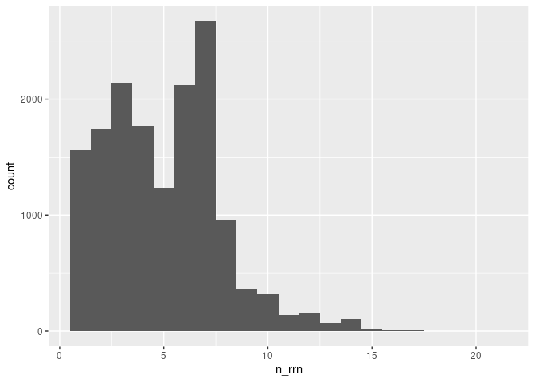
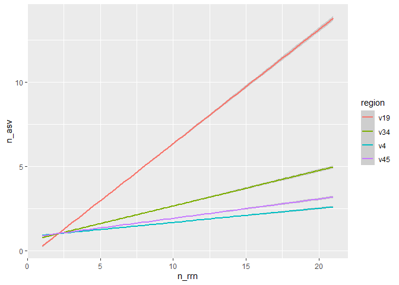

Analyzing the sensitivity and specifity of ASVs for descriminating
between genomes
================
2022-12-11

``` r
library(tidyverse)
library(here)
```

### Need to determine the number of *rrn* operons across genomes

Our analysis will use full length sequnces

``` r
count_tibble <- read_tsv(here("data/processed/rrnDB.count_tibble"),
                         col_types = "cccd")
```

We want to count and plot the number of copies per genome

``` r
count_tibble %>% 
    filter(region == "v19") %>%
    group_by(genome) %>%
    summarize(n_rrn = sum(count), .groups = "drop") %>%
    ggplot(aes(x=n_rrn)) + geom_histogram(binwidth = 1)
```

<!-- -->

``` r
count_tibble %>% 
    filter(region == "v19") %>%
    group_by(genome) %>%
    summarize(n_rrn = sum(count)) %>%
    count(n_rrn) %>%
    mutate(fraction = n / sum(n))
```

    ## # A tibble: 20 × 3
    ##    n_rrn     n  fraction
    ##    <dbl> <int>     <dbl>
    ##  1     1  1565 0.102    
    ##  2     2  1741 0.113    
    ##  3     3  2143 0.139    
    ##  4     4  1769 0.115    
    ##  5     5  1232 0.0801   
    ##  6     6  2120 0.138    
    ##  7     7  2671 0.174    
    ##  8     8   964 0.0626   
    ##  9     9   364 0.0237   
    ## 10    10   321 0.0209   
    ## 11    11   139 0.00903  
    ## 12    12   157 0.0102   
    ## 13    13    68 0.00442  
    ## 14    14   100 0.00650  
    ## 15    15    23 0.00149  
    ## 16    16     5 0.000325 
    ## 17    17     4 0.000260 
    ## 18    18     1 0.0000650
    ## 19    19     1 0.0000650
    ## 20    21     1 0.0000650

We see that most genomes actually have more than one copy of the *rrn*
operon. I wonder whether those different copies are the same sequence /
ASV..

### Determine number of ASVs per genoem

Considering most genomes have multiple copies of the *rrn* operon, we
need to know whether the all have the same ASVs. Otherwise we run the
risk of splitting a single genome into multiple ASVs.

``` r
count_tibble %>%
    group_by(region, genome) %>%
    summarize(n_asv = n(), n_rrn = sum(count), .groups = "drop") %>%
    group_by(region, n_rrn) %>%
    summarize(med_n_asv = median(n_asv),
              mean_n_asv = mean(n_asv),
              lq_n_asv = quantile(n_asv, prob=0.25),
              uq_n_asv = quantile(n_asv, prob=0.75)) %>%
    filter(n_rrn == 7)
```

    ## `summarise()` has grouped output by 'region'. You can override using the
    ## `.groups` argument.

    ## # A tibble: 4 × 6
    ## # Groups:   region [4]
    ##   region n_rrn med_n_asv mean_n_asv lq_n_asv uq_n_asv
    ##   <chr>  <dbl>     <dbl>      <dbl>    <dbl>    <dbl>
    ## 1 v19        7         5       4.51        3        6
    ## 2 v34        7         2       1.99        1        3
    ## 3 v4         7         1       1.37        1        1
    ## 4 v45        7         1       1.54        1        2

``` r
count_tibble %>%
    group_by(region, genome) %>%
    summarize(n_asv = n(), n_rrn = sum(count), .groups = "drop") %>%
    ggplot(aes(x=n_rrn, y=n_asv, color=region)) + 
    geom_smooth(method = "lm")
```

    ## `geom_smooth()` using formula = 'y ~ x'

<!-- -->

Suprisingly (or not!) the number of ASVs increases at a rate of about 2
ASVs per 3 copies of *rrn* operon in the genome. The sub region of the
16S rRNA region have few ASVs per *rrn* operon.

### Determine whether an ASV is unique to genomes they are found in

Instead of looking at the number of ASVs per genome, we want to see the
number of genomes per ASV

``` r
count_tibble %>%
    group_by(region, asv) %>%
    summarize(n_genomes = n()) %>%
    count(n_genomes) %>%
    mutate(fraction = n/sum(n)) %>%
    filter(n_genomes == 1)
```

    ## `summarise()` has grouped output by 'region'. You can override using the
    ## `.groups` argument.

    ## # A tibble: 4 × 4
    ## # Groups:   region [4]
    ##   region n_genomes     n fraction
    ##   <chr>      <int> <int>    <dbl>
    ## 1 v19            1 19247    0.824
    ## 2 v34            1  7240    0.779
    ## 3 v4             1  4581    0.758
    ## 4 v45            1  5701    0.777

We see that with full length sequences, thAT 82% of the ASVs were unique
to a genome. For the sub regions, about 76% were unique to a genome.

### To be determined…

- Can we correct for over-representation?
- Consider analysis at species, genus, family, etc. levels
- Consider looking at more broad definition of an ASV
