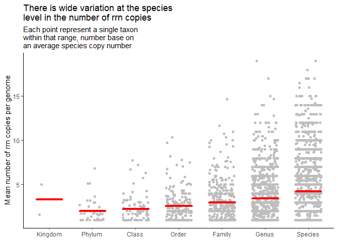

Quantifying the number of *rrn* operons across taxonomic ranks
================
adimascf
2022-12-16

``` r
library(tidyverse)
library(here)

metadata <- read_tsv(here("data/references/genome_id_taxonomy.tsv"),
                     col_types = cols(.default = col_character())) %>%
    mutate(strain = if_else(scientific_name == species, 
                            NA_character_, scientific_name)) %>%
    select(-scientific_name) 

asv <- read_tsv(here("data/processed/rrnDB.count_tibble"),
                col_types = cols(.default = col_character(),
                                 count = col_integer()))

metadata_asv <- inner_join(metadata, asv, by=c("genome_id" = "genome"))
```

### Plot the number of *rrn* copies per taxonomic rank

Our analysis will use full length sequences. We want to count and plot
the number of copies per *taxonomic rank*. Before calculating the
averages of each taxonomic group, we should first get an average number
of copies for each species. This will allow us to control for uneven
number of genomes in each species.

``` r
rank_taxon_rrn <- metadata_asv %>%
    filter(region == "v19") %>%
    group_by(kingdom, phylum, class, order, family, genus, species, genome_id) %>%
    summarize(n_rrns = sum(count), .groups = "drop") %>%
    group_by(kingdom, phylum, class, order, family, genus, species, genome_id) %>%
    summarize(mean_rrns = mean(n_rrns), .groups = "drop") %>%
    pivot_longer(-mean_rrns, names_to = "rank", values_to = "taxon") %>%
    drop_na(taxon) %>%
    mutate(rank = factor(rank,
                         levels = c("kingdom", "phylum", "class",
                                    "order", "family", "genus",
                                    "species"))) %>%
    group_by(rank, taxon) %>%
    summarize(mean_rrns = mean(mean_rrns), .groups = "drop") %>%
    drop_na(rank)

mean_of_means <- rank_taxon_rrn %>%
    group_by(rank) %>%
    summarize(mean_mean_rrns = mean(mean_rrns), .groups = "drop")


jitter_width <- 0.3
n_ranks <- nrow(mean_of_means)

rank_taxon_rrn %>%
    ggplot(aes(x=rank, y=mean_rrns)) +
    geom_jitter(width = jitter_width, color="gray") +
    geom_segment(data=mean_of_means, aes(x=1:n_ranks - jitter_width, 
                                         xend=1:n_ranks + jitter_width,
                                         y=mean_mean_rrns, 
                                         yend=mean_mean_rrns),
               color="red", size=1.5, group=1,
               lineend = "round",
               inherit.aes = FALSE) +
    theme_classic() +
    labs(x=NULL, y="Mean number of rrn copies per genome",
         title = "There is wide variation at the species\nlevel in the number of rrn copies",
         subtitle = "Each point represent a single taxon\nwithin that range, number base on\nan average species copy number") +
    scale_x_discrete(breaks=c("kingdom", "phylum", "class",
                                    "order", "family", "genus",
                                    "species"),
                     labels=c("Kingdom", "Phylum", "Class",
                                    "Order", "Family", "Genus",
                                    "Species"))
```

    ## Warning: Using `size` aesthetic for lines was deprecated in ggplot2 3.4.0.
    ## ℹ Please use `linewidth` instead.

<!-- -->

Bacteria have more copies than Arhchea even after correcting for number
of genomes per species, there is wide variation in the number of rrn
operons per taxonomic group.
