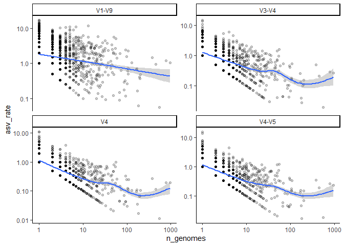

Quantifying the number of *rrn* operons across taxonomic ranks
================
adimascf
2022-12-16

``` r
library(tidyverse)
library(here)

metadata <- read_tsv(here("data/references/genome_id_taxonomy.tsv"),
                     col_types = cols(.default = col_character())) %>%
    mutate(strain = if_else(scientific_name == species, 
                            NA_character_, scientific_name)) %>%
    select(-scientific_name) 

asv <- read_tsv(here("data/processed/rrnDB.count_tibble"),
                col_types = cols(.default = col_character(),
                                 count = col_integer()))

metadata_asv <- inner_join(metadata, asv, by=c("genome_id" = "genome"))
```

### How many ASVs describe a species and does that number plateau with number of genomes?

We have previously seen that the number of ASVs per copy of the rRNA
gene is about 0.6. This means that if a genome has 10 copies of the 16S
rRNA gene, we would expect to see about 6 different versions of the gene
within that genome. Across genomes from the same species, we know that
the number of copies of the gene is pretty consistent. So, if we look at
multiple genomes from the same species, will we see the same versions of
the gene or will we see new versions of the gene? To answer this, we
would like to look at the relationship between the number of ASVs found
in a species per number of genomes in the species versus the number of
genomes. Besides looking at the full-length sequences, let’s also look
at the V4, V3, V4-V5.

``` r
# x = number of genomes for that species
# y = ratio of the number of ASVs per genome
# each point represent a different species
# each facet represent a different region

species_asv <- metadata_asv %>%
    select(genome_id, species, region, asv) %>%
    group_by(region, species) %>%
    summarize(n_genomes = n_distinct(genome_id), n_asv = n_distinct(asv),
              asv_rate = n_asv/n_genomes,
              .groups = "drop")


region_labels <- c("V1-V9", "V4", "V3-V4", "V4-V5")
names(region_labels) <- c("v19", "v4", "v34", "v45")

species_asv %>%
    ggplot(aes(x=n_genomes, y=asv_rate)) +
    geom_point(alpha=0.2) +
    geom_smooth() +
    facet_wrap(facets = "region", nrow = 2,
               strip.position = "top",
               scales = "free_y",
               labeller = labeller(region=region_labels)) +
    scale_x_log10() +
    scale_y_log10() +
    theme_classic()
```

    ## `geom_smooth()` using method = 'gam' and formula = 'y ~ s(x, bs = "cs")'

<!-- -->

### Conclusion

- V1-V9 continues to add significant number of ASVs as more genomes are
  sampled from a species
- The sub regions seem to have pleateued indicatiing that perhaps we
  will always add more ASVs for a species.
- Perhaps we really are splitting genomes and speies too finely
- Would like to look at individual species in more detail
