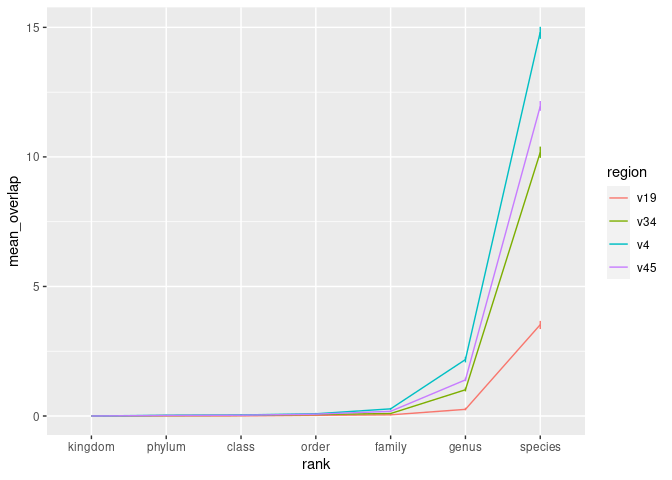

Quantifying the overlap of ASVs between taxa
================
adimascf
2022-12-16

``` r
library(tidyverse)
library(here)
library(knitr)

metadata <- read_tsv(here("data/references/genome_id_taxonomy.tsv"),
                     col_types = cols(.default = col_character())) %>%
    mutate(strain = if_else(scientific_name == species, 
                            NA_character_, scientific_name)) %>%
    select(-scientific_name) 

asv <- read_tsv(here("data/processed/rrnDB.count_tibble"),
                col_types = cols(.default = col_character(),
                                 count = col_integer()))

metadata_asv <- inner_join(metadata, asv, by=c("genome_id" = "genome"))
```

### How often is the same ASV found in multiple taca from the same rank?

Across the analyses, we have already seen that a single bacterial genome
can have multiple ASVs and that depending on the species we are looking
at, there may be as many ASVs as there are genome sequences for that
species. To me, this says that ASVs pose a risk at unnaturally splitting
a species and even a genome into multiplt taxonomic groupings! In my
book, that is not good.

Today, I want to ask an equally important question: If I have an ASV,
what is the probability that it is also found in another taxonomic group
from the same rank? In other words, if I have an ASV from Bacillus
subtilis, what is the probability of finding it in Bacillus cereus? Of
course, it is probably more likely to find a Bacillus subtillis ASV in a
more closely related organism like Bacillus cereus than E. coli. Perhaps
we can control for relatedness in a future episode, but for today, I
want to answer this question for any two taxa from the same rank.

``` r
# set RNG seed
set.seed(1)

get_subsample_result <- function(threshold) {
# metadata_asv - species - genome_id
    subsample_species <- metadata_asv %>%
        select(genome_id, species) %>%
    # return the distinct/unique rows
        distinct() %>%
    # group_by species
        group_by(species) %>%
    # slice_sample on each species for N genomes
        slice_sample(n=threshold, replace = T) %>%
        distinct() %>%
        ungroup()
    
    good_species <- subsample_species %>%
    # count number of genomes in each species
        count(species) %>%
    # return species that have N genomes / filter out species with fewer
        filter(n == threshold) %>%
        select(species)
    
    # going back to original list of species/genomes and return the genome_ids
    # from species with N genomes
    
    subsampled_genomes <- inner_join(subsample_species, good_species,
                                     by="species") %>%
        select(genome_id)
    
    
    
    
    
    
    # metadata_asv - input data
    overlap_data <- inner_join(metadata_asv, subsampled_genomes,
                               by="genome_id") %>%
    # - focus on taxonomic ranks - kingdom to species, asv, and region
        select(-genome_id, -count, -strain) %>%
    # - make data frame tidy
        pivot_longer(cols = c(-region, -asv), names_to = "rank", 
                     values_to = "taxon") %>%
    # - remove line from the data where we do not a taxonomy
        drop_na(taxon) %>%
    # - remove redundant lines
        distinct() %>%
    
    # for each region and taxonomic rank, group by asvs `
        group_by(region, rank, asv) %>%
    # - for each asv - count the number of taxa
        summarize(n_taxa=n(), .groups = "drop_last") %>%
    # - count the number of asvs that appear in more than one taxa
        count(n_taxa) %>%
    # - find the ratio od the number of asvs in more than one taxa to the total number of asvs
        summarize(overlap = sum((n_taxa > 1) * n) / sum(n), .groups = "drop") %>%
        mutate(rank = factor(rank,
                             levels = c("kingdom", "phylum", "class",
                                        "order", "family", "genus", "species"))) %>%
        mutate(overlap = 100*overlap)
    
    return(overlap_data)
}

subsample_iteration <- map_dfr(1:100, 
                               ~get_subsample_result(threshold = 1), 
                               .id = "iterations")

summary_overlap_data <- subsample_iteration %>%
    group_by(region, rank) %>%
    summarize(mean_overlap = mean(overlap),
              lci = quantile(overlap, prob=0.025),
              uci = quantile(overlap, prob=0.975),
              .groups = "drop")
# Create a plot showing specificity at each taxonomic rank for each region
# x = taxonomic rank
# y = specificity or % of asvs found in more than one taxa
# geom = line plot
# different lines for each region of 16S rRNA gene
summary_overlap_data %>%
    ggplot(aes(x = rank, y = mean_overlap, 
               group = region, color=region,
               ymin = lci, ymax = uci)) +
    geom_linerange(show.legend = FALSE) +
    geom_line()
```

<!-- -->

``` r
summary_overlap_data %>%
    filter(rank == "species") %>%
    kable(digits = 1)
```

| region | rank    | mean_overlap |  lci |  uci |
|:-------|:--------|-------------:|-----:|-----:|
| v19    | species |          3.5 |  3.4 |  3.7 |
| v34    | species |         10.2 | 10.0 | 10.4 |
| v4     | species |         14.8 | 14.6 | 15.0 |
| v45    | species |         12.0 | 11.8 | 12.2 |

### Conclusion

- Sub region are less specific at every taxonomic rank than full-length
  sequences. Still full-length has 3.6% overlap whereas the sub-region
  are between 10% and 15% overlap
